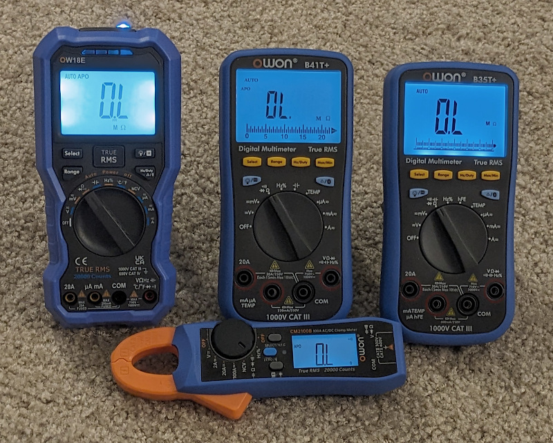

# OWON Bluetooth Meters on Linux

## Linux CLI Support for B35T+, B41T+, OW18E, CM2100B

Captures, converts, displays and stores Bluetooth (BLE) output from these meters.

# Requirements
gatttool needs to be installed and operational in linux for this application to work.

# Setup

	1) Build owon_multi_cli

	$ make

	2) Find the multimeter (string should be BDM):

	$ sudo hcitool lescan
	62:9C:C3:39:99:2F (unknown)
	56:E2:58:23:66:3F (unknown)
	34:49:51:A5:9C:C7 (unknown)
	A6:C0:80:94:54:D9 BDM
	40:CB:C0:E3:15:7B (unknown)
	5C:02:EA:FB:05:68 (unknown)
	76:EA:A1:21:72:2A (unknown)
	6B:CE:24:60:40:31 (unknown)

	or try using this discovery tool:
 
	$ python3 -u ./py-ble-scan2.py
	A6:C0:80:94:54:D9 BDM

	If your hci0 (or ble stack) is stuck, try resetting via:
 
	$ sudo python3 -u ./hci-resetter.py --now
	Resetting HCI hci0
	HCI hci0 has been reset

	3) Run the app with the multimeter address as the first parameter, 
 	   and the meter type as the second:

	$ sudo ./owon_multi_cli -a A6:C0:80:94:54:D9 -t cm2100b

	(by default, you'll likely have to run this under sudo because the gatttool
	won't seem to talk to BLE devices initially without being superuser/root)
	
	
	4) If you want to see the raw hex bytes (from linux cli):
	
	$ gatttool -b A6:C0:80:E5:84:0C -I
	[A6:C0:80:E5:84:0C][LE]> connect
	Attempting to connect to A6:C0:80:E5:84:0C
	Connection successful
	Notification handle = 0x001b value: 24 f0 04 00 00 00 
	Notification handle = 0x001b value: 24 f0 04 00 00 00 
	Notification handle = 0x001b value: 24 f0 04 00 00 00 
	Notification handle = 0x001b value: 24 f0 04 00 00 00 
	Notification handle = 0x001b value: 24 f0 04 00 00 00 
	Notification handle = 0x001b value: 24 f0 04 00 00 00 
	Notification handle = 0x001b value: 24 f0 04 00 00 00 
	Notification handle = 0x001b value: 24 f0 04 00 00 00 
	[A6:C0:80:E5:84:0C][LE]> quit

	* Use your device's BLE MAC address.  
	* The 0x001b value may be the same or it may be different for you.  
	* If your (new) meter shows a different handle id, 
	  you can try to edit the source code and see if the application decodes your stream.  
	* Run the application with "-d" switch for debugging output.

# Usage
	$ sudo ./owon_multi_cli

	Usage: ./owon_multi_cli  -a <address> -t b35t|b41t|cm2100b|ow18e [-l <filename>] [-d] [-q]
	-h: This help
	-a <address>: Set the address of the cm2100b meter, eg, -a 98:84:E3:CD:C0:E5
	-t b35t|b41t|cm2100b|ow18e: Which model of meter
 	-l <filename>: Log text output to a file
	-d: debug enabled
	-j: json output
	-q: quiet output
	-1: run once (one data point) and then exit

# Example
	Run the application, sending output to stdout, and also log to a file.

	Timestamps are unix epoch with 2-digit fractional seconds. Numeric field
	follows, then meter mode token strings.
	
	$ sudo ./owon_multi_cli -a A6:C0:80:94:54:D9 -t cm2100b -l foo.out
	1699308108.32 00.00 DC mV
	1699308108.58 -0.01 DC mV
	1699308109.11 -0.01 DC mV
	1699308109.66 -0.01 DC mV
	1699308110.18 -0.01 DC mV
	1699308110.39 00.00 DC mV
	1699308110.89 00.00 DC mV
	1699308111.39 00.00 DC mV
	1699308111.92 00.00 DC mV
	1699308112.21 -0.01 DC mV
	1699308112.42 00.00 DC mV

	Here is a run with json style output:
 
	$ sudo ./owon_multi_cli -a A6:C0:80:E5:84:0C -t ow18e -j
	{ "Timestamp": "1706211070.13", "Display_Value": "2.390 K Ohms" }
	{ "Timestamp": "1706211070.63", "Display_Value": "2.390 K Ohms" }
	{ "Timestamp": "1706211071.13", "Display_Value": "2.390 K Ohms" }
	{ "Timestamp": "1706211071.65", "Display_Value": "2.390 K Ohms" }
	{ "Timestamp": "1706211072.18", "Display_Value": "2.390 K Ohms" }

	Run the application just once and exit.  Show examples with both json and text:
 
	$ sudo ./owon_multi_cli -a A6:C0:80:94:54:D9 -t cm2100b -1
	1706753314.87 04.95 Ohms
	
	$ sudo ./owon_multi_cli -a A6:C0:80:94:54:D9 -t cm2100b -1 -j
	{ "Timestamp": "1706753412.52", "Display_Value": "1.0059 K Ohms" }

# Unit Testing
	Run the application in debug and json mode and save its output to a file.
	
	$ sudo ./owon_multi_cli -a A6:C0:80:E5:84:0C -t ow18e -j -d > ow18e-ref-data-ohms.txt
	{ "BLE_bytes" : "[2b, f1, 04, 00, 56, 09]", "Function": "00000100", "Scale": "05", "Decimal": "03", "Measurement": "2390", "Timestamp": "1706210330.73", "Display_Value": "2.390 K Ohms" }
	{ "BLE_bytes" : "[2b, f1, 04, 00, 56, 09]", "Function": "00000100", "Scale": "05", "Decimal": "03", "Measurement": "2390", "Timestamp": "1706210331.23", "Display_Value": "2.390 K Ohms" }
	{ "BLE_bytes" : "[2b, f1, 04, 00, 56, 09]", "Function": "00000100", "Scale": "05", "Decimal": "03", "Measurement": "2390", "Timestamp": "1706210331.73", "Display_Value": "2.390 K Ohms" }

	
	There is a helper python script "wrap_json_lines.py" that can take the raw json lines from the 
 	cli output and wrap them into a fully parsable json block:

	$ ./wrap_json_lines.py -f ow18e-ref-data-ohms.txt  | python -mjson.tool
	
	[
         {
         "BLE_bytes": "[2a, f1, 04, 00, af, 08]",
         "Function": "00000100",
         "Scale": "05",
         "Decimal": "02",
         "Measurement": "2223",
         "Timestamp": "1706209552.45",
         "Display_Value": "22.23 K Ohms"
         },
         {
         "BLE_bytes": "[2a, f1, 04, 00, af, 08]",
         "Function": "00000100",
         "Scale": "05",
         "Decimal": "02",
         "Measurement": "2223",
         "Timestamp": "1706209552.97",
         "Display_Value": "22.23 K Ohms"
         },
         {
         "BLE_bytes": "[2a, f1, 04, 00, af, 08]",
         "Function": "00000100",
         "Scale": "05",
         "Decimal": "02",
         "Measurement": "2223",
         "Timestamp": "1706209553.50",
         "Display_Value": "22.23 K Ohms"
         }
	]

	
# Hint on Linux Line Buffering
	Do you know about the 'stdbuf' command?  Try something like this, if your output is 'laggy':

	$ stdbuf -o0 ./owon_multi_cli -a A6:C0:80:94:54:D9 -t cm2100b -j -d | tee cm2100b-ref-data-ohms.txt

	stdbuf with '-o0' is about output buffering.  This method, when run before your main cli command,
 	will disable the internal buffering of the operating system.

	Also, note that for python apps, there is a different method that must be used.  Use the '-u' switch
 	and run python3 (the interpreter) directly as:

	$ python3 -u some_python_app.py

	and that will enable more real-time stdout buffering with python.
	

	
# Resources
* (https://github.com/ludwich66/Bluetooth-DMM/wiki/Bluetooth---Analyses)
* (https://github.com/ludwich66/Bluetooth-DMM/wiki/)
* (https://www.eevblog.com/forum/testgear/owon-cm2100b-is-uni-t-ut210e-inspired/msg5153328/)
* (https://github.com/DeanCording/owonb35)
* (https://github.com/jtcash/OwonB41T)
* (https://rudd-o.com/linux-and-free-software/working-around-bluetooth-hci-problems-in-home-assistant)
* (https://stackoverflow.com/questions/66196897/python-ble-discover-all-uuid-characteristics)
* (https://m5.8266.de/?msel=stip_bt_dmm)
* (https://github.com/inflex/owon-b35)
* (https://github.com/kwasmich/ow18e)
* (https://justanotherelectronicsblog.com/?p=930)
* (https://github.com/riktw/AN9002_info)
* (https://github.com/Shiro-Nek0/Bluetooth-DMM.py)
  
