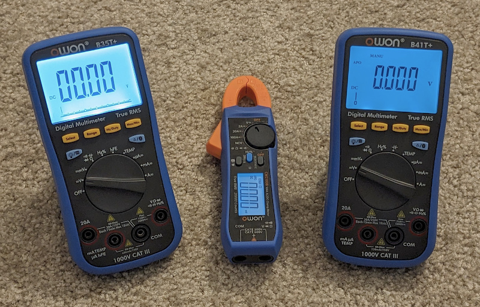

# OWON Bluetooth Meters (B35T+, B41T+, CM2100B)

## Linux BLE CLI Application
OWON Mutltimeter data capture and display for Linux.

Captures, converts, displays and stores Bluetooth (BLE) output from these meters.

# Requirements
gatttool needs to be installed and operational in linux for this application to work.

# Setup

	1) Build owon_multi_cli

	$ make

	2) Find the multimeter (string should be BDM):

	$ sudo hcitool lescan
	62:9C:C3:39:99:2F (unknown)
	56:E2:58:23:66:3F (unknown)
	34:49:51:A5:9C:C7 (unknown)
	A6:C0:80:94:54:D9 BDM
	40:CB:C0:E3:15:7B (unknown)
	5C:02:EA:FB:05:68 (unknown)
	76:EA:A1:21:72:2A (unknown)
	6B:CE:24:60:40:31 (unknown)

	or try using this discovery tool:
 
	$ python3 -u ./py-ble-scan2.py
	A6:C0:80:94:54:D9 BDM

	If your hci0 (or ble stack) is stuck, try resetting via:
 
	$ sudo python3 -u ./hci-resetter.py --now
	Resetting HCI hci0
	HCI hci0 has been reset

	3) Run the app with the multimeter address as the first parameter, and the meter type as the second:

	$ sudo ./owon_multi_cli -a A6:C0:80:94:54:D9 -t cm2100b

	(by default, you'll likely have to run this under sudo because the gatttool
	won't seem to talk to BLE devices initially without being superuser/root)

# Usage
	$ sudo ./owon_multi_cli

	Usage: ./owon_multi_cli  -a <address> -t b35t|b41t|cm2100b [-l <filename>] [-d] [-q]
	-h: This help
	-a <address>: Set the address of the cm2100b meter, eg, -a 98:84:E3:CD:C0:E5
	-t b35t|b41t|cm2100b: Which model of meter (only list one)
 	-l <filename>: Set logging and the filename for the log
	-d: debug enabled
	-q: quiet output

# Example
	Run the application, sending output to stdout, and also log to a file.

	Timestamps are unix epoch with 2-digit fractional seconds. Numeric field
	follows, then meter mode token strings.
	
	$ sudo ./owon_multi_cli -a A6:C0:80:94:54:D9 -t cm2100b -l foo.out
	1699308108.32 00.00 DC mV
	1699308108.58 -0.01 DC mV
	1699308109.11 -0.01 DC mV
	1699308109.66 -0.01 DC mV
	1699308110.18 -0.01 DC mV
	1699308110.39 00.00 DC mV
	1699308110.89 00.00 DC mV
	1699308111.39 00.00 DC mV
	1699308111.92 00.00 DC mV
	1699308112.21 -0.01 DC mV
	1699308112.42 00.00 DC mV

# Resources
* (https://github.com/ludwich66/Bluetooth-DMM/wiki/Bluetooth---Analyses)
* (https://github.com/ludwich66/Bluetooth-DMM/wiki/)
* (https://www.eevblog.com/forum/testgear/owon-cm2100b-is-uni-t-ut210e-inspired/msg5153328/)
* (https://github.com/DeanCording/owonb35)
* (https://github.com/jtcash/OwonB41T)
* (https://rudd-o.com/linux-and-free-software/working-around-bluetooth-hci-problems-in-home-assistant)
* (https://stackoverflow.com/questions/66196897/python-ble-discover-all-uuid-characteristics)
* (https://m5.8266.de/?msel=stip_bt_dmm)
* (https://github.com/inflex/owon-b35)
	
