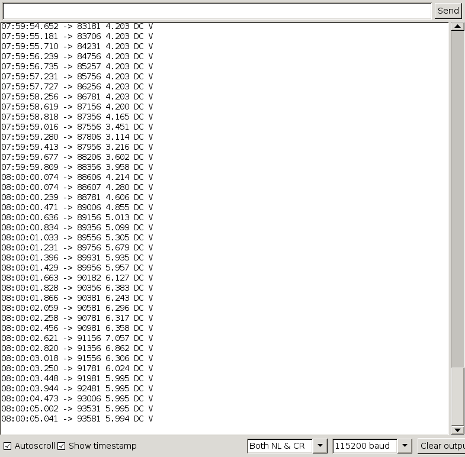

# ESP32 source code for simple console (serial 115200) ascii output

# Requirements

esp32 arduino core installed; user should be able to build any BLE demo app, first, to verify their build environment.

More info to come ...
